# CONVERSOR DE MOEDAS COM COTAÇÃO EM TEMPO REAL

### Este é um exemplo simples de um Conversor de Moedas criado utilizando HTML, CSS e JavaScript. Ele permite que os usuários insiram um valor e escolham a moeda de origem e a moeda de destino para realizar a conversão.

## Funcionalidade

O usuário pode inserir um valor em um campo de texto.
O usuário pode escolher a moeda de origem (De) e a moeda de destino (Para) a partir de menus suspensos.
Ao clicar no botão "Converter", o valor é convertido de acordo com a taxa de câmbio entre as moedas selecionadas.
Um botão "Limpar" permite limpar os campos do formulário.

## Estrutura HTML

O HTML é a linguagem usada para criar a estrutura de uma página web. Ele define os elementos e a organização do conteúdo que será exibido no navegadorEstrutura HTML
O HTML é a linguagem usada para criar a estrutura de uma página web. Ele define os elementos e a organização do conteúdo que será exibido no navegador.

## Explicando as partes do HTML

1. !DOCTYPE html
Esta linha declara o tipo de documento como HTML5. Ela é obrigatória e informa ao navegador que o código será interpretado como uma página web usando a versão mais recente do HTML (HTML5).

2. html lang="pt-BR"
A tag html é o elemento raiz da página, que envolve todo o conteúdo HTML. O atributo lang="pt-BR" indica que a língua da página é o português brasileiro.

3. head
A tag head contém informações sobre o documento, mas não é exibida diretamente na página. Ela inclui metadados, como a codificação de caracteres, o título da página, links para arquivos externos e outras configurações.

meta charset="UTF-8": Define o conjunto de caracteres utilizado no documento, garantindo que caracteres especiais (como acentos) sejam corretamente exibidos.
meta name="viewport" content="width=device-width, initial-scale=1.0": Define a configuração da viewport para dispositivos móveis, tornando a página responsiva. Isso ajuda a ajustar o layout conforme o tamanho da tela.
title Conversor de Moedas /title : Define o título da página, que é exibido na aba do navegador.
link rel="stylesheet" href="style.css": Faz a ligação com o arquivo CSS externo, que vai estilizar a página (mudando o layout, cores, fontes, etc.).
4. body
A tag body contém o conteúdo visível da página, ou seja, é onde tudo o que aparece no navegador será colocado.

Dentro do body, temos a estrutura principal da interface do conversor de moedas:

4.1. div class="container"
Essa div funciona como um container para todo o conteúdo da página, ajudando a organizar o layout. O atributo class="container" pode ser usado para aplicar estilos específicos via CSS.

4.2. h1 Conversor de Moedas /h1
Aqui temos um título de nível 1 (h1), que é o título principal da página. Esse título é exibido em uma fonte maior e é normalmente utilizado para representar o nome ou o objetivo da página.

4.3. form id="currency-form"
A tag form cria um formulário de entrada, onde os usuários podem inserir dados. Este formulário tem o id="currency-form", que é usado para identificá-lo e associá-lo ao código JavaScript (onde o comportamento do formulário será manipulado).

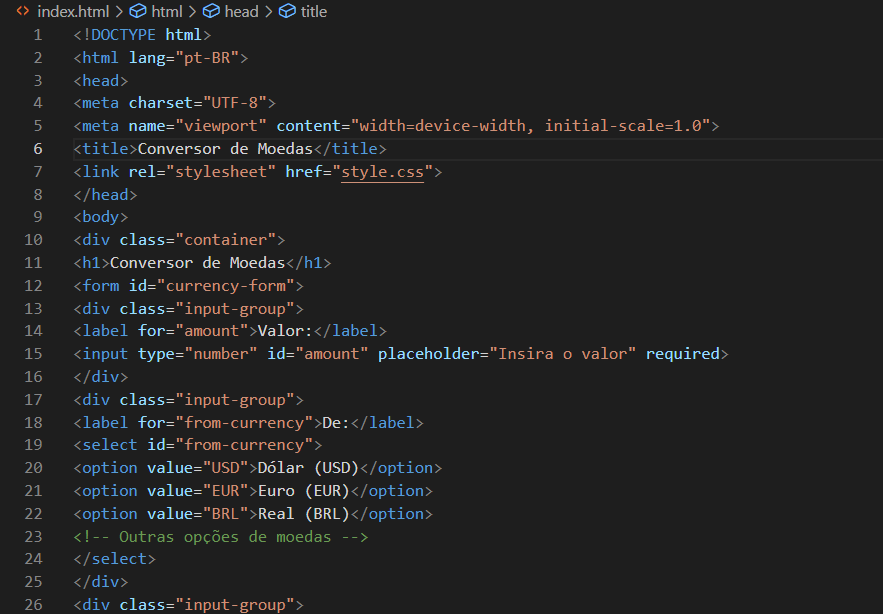
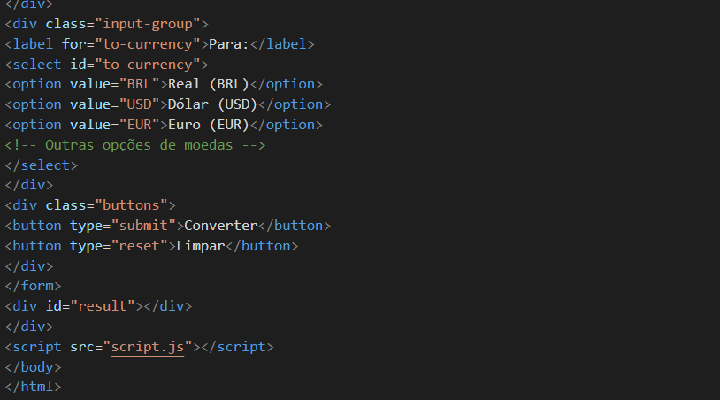

A tag label cria uma legenda para o campo de entrada. O atributo for="amount" vincula o rótulo ao campo de entrada com id="amount".
A tag input cria um campo de entrada para o usuário inserir o valor. O type="number" indica que o campo deve aceitar apenas números.
O atributo placeholder="Insira o valor" fornece um texto de exemplo para o usuário, mostrando o que deve ser inserido no campo.
O atributo required garante que o campo não possa ser deixado em branco.
A tag select cria uma lista suspensa, permitindo ao usuário escolher entre várias opções.
Cada option representa uma opção dentro da lista suspensa. O value especifica o valor enviado ao servidor ou manipulado pelo JavaScript quando a opção é selecionada.
Botão "Converter" (submit): Este botão envia o formulário para ser processado. Quando clicado, o formulário chama a função JavaScript para fazer a conversão de moedas.
Botão "Limpar" (reset): Este botão limpa os campos do formulário, deixando-os vazios.

## Resumo
Este código HTML é uma estrutura básica para um conversor de moedas, composta por:

Formulário de entrada de dados com campos de valor, moeda de origem e moeda de destino.
Botões para enviar ou limpar o formulário.
Um espaço para exibir o resultado da conversão.

## Estrutura JavaScript
 
Este trecho de código JavaScript realiza a conversão de moedas usando uma API externa para obter as taxas de câmbio em tempo real.

# EXCHANGERATE-API

Apos efetuar o login no site foi recebido um email com link.

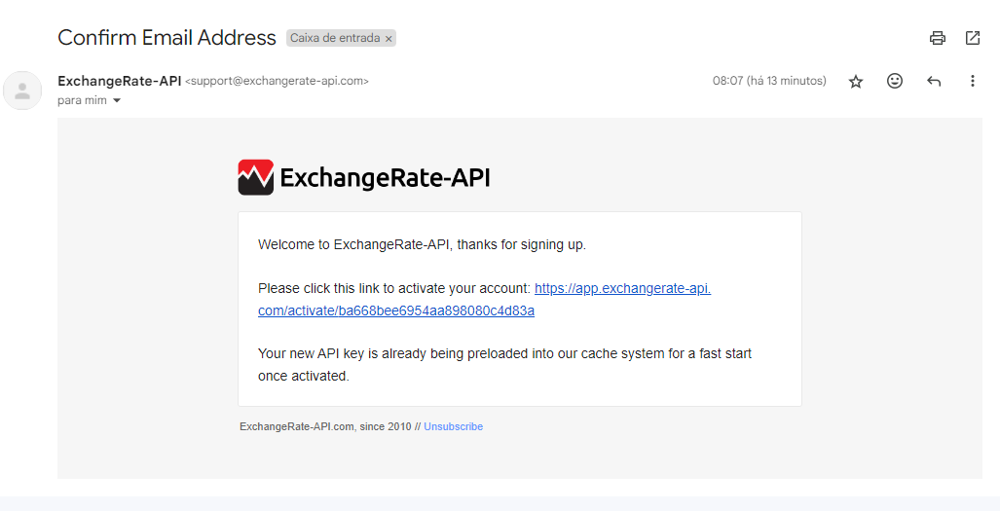

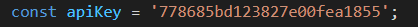

Nesta linha, a variável apiKey é definida com uma chave de API. Essa chave é como uma senha que autentica o usuário para acessar os serviços de uma API. No caso, o serviço que está sendo acessado é a ExchangeRate-API, que fornece taxas de câmbio.

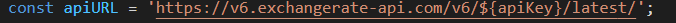

Nesta linha, a variável apiURL é definida para armazenar a URL base da API de taxas de câmbio.

## Event Listener para o Formulário

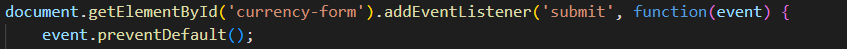

document.getElementById('currency-form'): Aqui, estamos selecionando o formulário HTML com o ID currency-form.
addEventListener('submit', function(event) {...}): Estamos adicionando um "ouvinte de evento" para o evento submit (envio) do formulário. Quando o formulário for enviado (clicar no botão "Converter"), a função que está dentro deste ouvinte será executada.
event.preventDefault(): Este comando impede que o formulário seja enviado da maneira tradicional (com o navegador recarregando a página). Com isso, o código JavaScript pode processar a conversão sem recarregar a página.

## Obtendo os Valores do Formulário

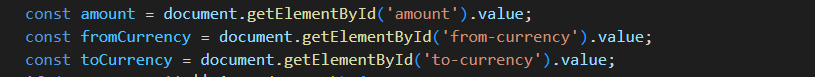

#### Aqui, estamos pegando os valores inseridos pelo usuário no formulário:

amount: O valor monetário que o usuário quer converter (extraído do campo de entrada com o ID amount).
fromCurrency: A moeda de origem selecionada (extraída do menu suspenso com o ID from-currency).
toCurrency: A moeda de destino selecionada (extraída do menu suspenso com o ID to-currency).

## Validação do Valor

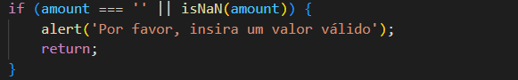

Antes de prosseguir, o código verifica se o campo de valor (amount) está vazio ou se o valor inserido não é um número válido (isNaN(amount) verifica se o valor não é um número).
Se a validação falhar, o código exibe um alerta pedindo para o usuário inserir um valor válido e interrompe a execução do código com o comando return

## Processando os Dados da API

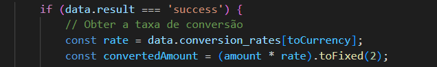

data.result === 'success': A API retorna um campo chamado result, que indica se a requisição foi bem-sucedida. O código verifica se o resultado da requisição foi success.
data.conversion_rates[toCurrency]: A API retorna um objeto chamado conversion_rates, que contém as taxas de câmbio para várias moedas. O código acessa a taxa de conversão específica para a moeda de destino (toCurrency).
const convertedAmount = (amount * rate).toFixed(2): O valor inserido pelo usuário (amount) é multiplicado pela taxa de câmbio (rate) para obter o valor convertido. O método .toFixed(2) formata o resultado para exibir 2 casas decimais.

## Exibindo o Resultado na Página

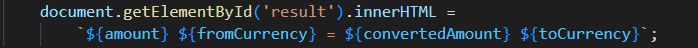

O resultado da conversão é exibido na div com o ID result.
A sintaxe de template string (usando crase ` `) permite que variáveis como amount, fromCurrency, convertedAmount e toCurrency sejam inseridas diretamente na string.

## Tratando Erros

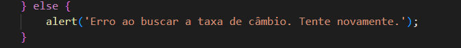

Se a API retornar um erro (caso data.result !== 'success'), um alerta será exibido, informando o erro na busca da taxa de câmbio.

## Capturando Erros de Rede ou Outros Erros

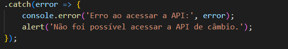

O método .catch() captura erros que possam ocorrer durante a requisição, como falhas de rede ou problemas com a API. Se um erro ocorrer, ele será exibido no console e um alerta será mostrado ao usuário.

## Resumo do Fluxo:

Usuário preenche o formulário com um valor, moeda de origem e moeda de destino.
Ao clicar em "Converter", o evento submit é disparado e o código previne o envio padrão do formulário.
O código valida se o valor inserido é válido.
A requisição é feita à API de câmbio para obter a taxa de conversão mais recente.
Se a requisição for bem-sucedida, o valor é convertido e exibido na página.
Se ocorrer algum erro, um alerta é mostrado ao usuário, informando sobre o problema.

